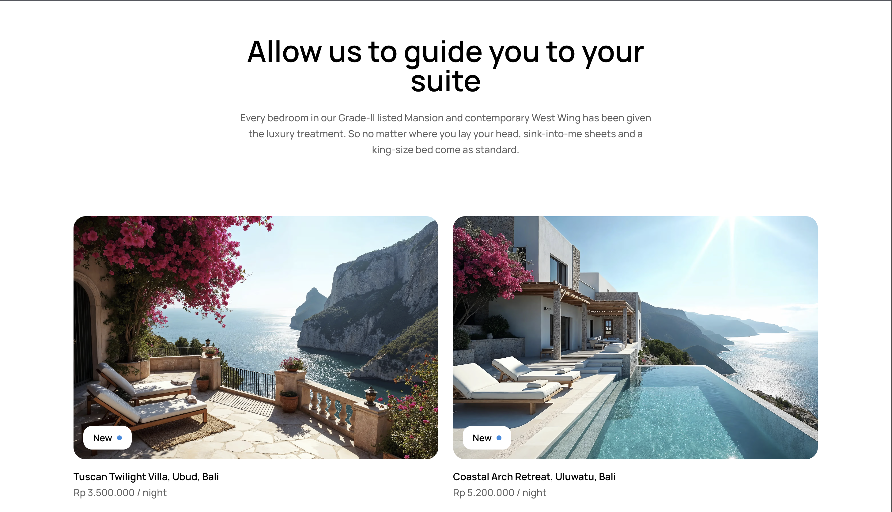
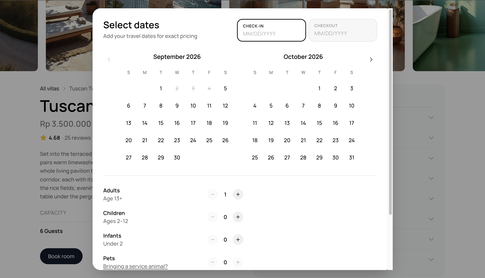
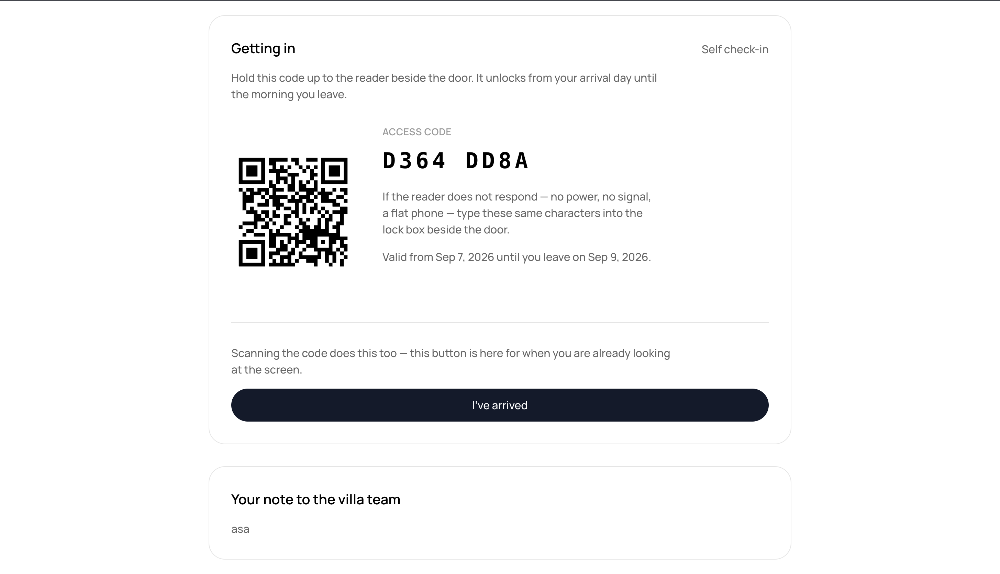

# The Seaspace

**A guest-facing booking site for a fictional private-villa resort** — browse the catalogue,
check live availability, book a stay through a simulated checkout, and self check in with a QR
code or an 8-character door code. No front desk in the loop.

[](https://the-seaspace-seven.vercel.app)


## Try it

**→ [the-seaspace-seven.vercel.app](https://the-seaspace-seven.vercel.app)**

> **Demo account** — `co@example.com` / `cococo`
> Already filled in on the sign-in form, so booking a stay is one click away. GitHub and
> Google sign-in work too.
>
> Payments are simulated end to end: no card details are ever asked for and no money moves.

A solo project with no client and no deadline, built to practise *defending* architectural
decisions rather than shipping fast. That shows up in the codebase as an unusual amount of
"why": migrations and feature READMEs record the options that were considered and rejected,
not just the ones that survived. Every claim below points at a file you can open.

## Screenshots

| Villa catalogue | Availability & booking |
|---|---|
|  |  |
| **Self check-in** | |
|  | |

## Features

- **Villa catalogue** — browse and filter stays, served from Supabase Postgres with photos in
  Supabase Storage.
- **Availability calendar & booking** — a live per-villa calendar and a checkout with guest
  counts and pricing, guarded so two guests can never hold the same nights.
- **Simulated checkout** — shaped like a real payment provider (network delay, a reachable
  decline path, an opaque reference, a separate settlement step) with no real money movement.
- **Self check-in** — a QR code and an 8-character door code, either of which opens the villa.
  An hourly job closes finished stays, releases abandoned unpaid holds, and marks no-shows.
- **Guest accounts** — email/password or GitHub/Google sign-in, profile editing, avatar upload.
- **Reviews** — tied to a real completed booking rather than a hand-set "verified" flag.
- **Experience requests** — enquiries for golf tee times, spa treatments, and event venues,
  simulated as an email to staff rather than pretending to be a real reservation.

## Tech stack

- **Next.js 16** (App Router, `cacheComponents` enabled) + **React 19**
- **TypeScript**, strict mode
- **Tailwind CSS v4** — theme lives in the CSS `@theme` block, no JS config file
- **Supabase** — Postgres, Auth, Storage. Deliberately **no ORM**: this app's security lives in
  Postgres (RLS, `SECURITY DEFINER` functions), and a connection-string ORM connects as a
  privileged user with no JWT, which makes `auth.uid()` null and every policy a no-op.
- **GSAP** + **Motion** — scroll and interaction animation
- **Leaflet** / **react-leaflet** — the stay-location map, on CARTO tiles (no API key, no
  billing account)
- **`qrcode`** — check-in QR codes, rendered to inline SVG on the server
- **`sharp`** — avatar re-encoding and EXIF stripping
- **Vitest** — unit tests for the pure booking/auth helpers
- Package manager: **pnpm** · Hosting: **Vercel**

## Engineering highlights

**RLS proves *who*; a function's parameter list proves *what*.** `public.bookings` has no
`anon` policy and none may be added — the anon key ships to every browser, and a `SELECT`
policy would hand it price, guest notes and guest ids straight off the table. Writes don't go
through an `INSERT` policy either, because RLS authorises *rows, not values*: a guest with a
valid session could still `POST` their own `unit_price_per_night = 1`. They go through
`create_booking()`, a `SECURITY DEFINER` function whose parameter list is the allow-list —
price and the door code are never parameters, they're computed inside.
→ `supabase/migrations/0009_bookings.sql`, `0011_booking_writes.sql`

**Double-booking is impossible at the schema level — and the decision was reversed in
writing.** Migration `0009` declined a GiST exclusion constraint, arguing overlap was already
prevented at the input path. Once concurrent writes actually existed, `0011` reversed that and
said so in the file rather than quietly editing the old comment. Two guests submitting the same
nights now produce one committed row and one Postgres `23P01`, which the server action turns
into a plain sentence.

**Payment is simulated on purpose, and keeps the shape a real provider imposes.** The booking
row is written *before* the charge — the row is the lock, so the exclusion constraint holds the
dates for the whole payment round-trip — then settled or cancelled. The stated cost: those
steps can't be one transaction, so a process dying mid-flight leaves a confirmed booking with
no `paid_at`. That renders honestly as "Payment pending" and is swept by an hourly `pg_cron`
job after 30 minutes. Swapping in Stripe means replacing one function and moving settlement
into a webhook. → `features/booking/lib/payment-gateway.ts`

**Cache Components used per function, not per route.** Without `cacheComponents: true`, one
`cookies()` read anywhere makes the *entire route* dynamic — which would have killed static
prerendering on `/stays/[stayId]` just to show a session-aware header. With it, freshness
becomes a per-call decision: `/stays` reads uncached inside a `<Suspense>` boundary so the
layout flushes instantly and skeletons hold the exact card geometry, while the villa detail
page stays prerendered and is invalidated by a Supabase webhook on write.

**Avatar uploads are re-encoded, not trusted.** Every upload goes through `sharp`; a file
`sharp` can't decode is rejected outright — that *is* the MIME check, instead of trusting a
`Content-Type` header — and the re-encoded WebP carries no EXIF forward, so a photo's GPS
coordinates never reach public storage. OAuth-copied avatars skip it, deliberately: those bytes
were already re-encoded by the provider's CDN and are already public at the provider's URL.
→ `features/account/README.md`

## Project structure

```
app/            Routing only — route groups (auth), (experiences), (stay-list)
features/       Product features, each owning its components, actions and domain logic
  account/      Profile + avatar          home/       Landing page sections
  auth/         Sign-in, sessions, OAuth  marketing/  Spa / golf / event-venue content
  booking/      Availability, checkout,   reviews/    Review carousel and cards
                arrival, lifecycle        services/   Amenities & services catalogue
  experience-requests/  Enquiry flows     stays/      Villa catalogue, detail page, map
ui/             Shared, domain-free UI primitives (header, footer, modal, buttons...)
lib/            Domain-free helpers — Supabase clients, formatting
supabase/       SQL migrations, seed data, and the setup/verification runbook
scripts/        One-off Node scripts (e.g. seeding demo accounts)
public/         Static brand and marketing imagery (villa photos live in Supabase Storage)
proxy.ts        Next 16's middleware equivalent — session cookie refresh + auth redirects
```

Two boundary rules hold this together. A feature owns the components that render its domain
objects, regardless of which page shows them — `StaysPreviewSection` renders on the landing
page but lives in `features/stays/` because it renders `Stay` objects. And there are zero
feature-to-feature imports: composition happens one level up, in `app/*/page.tsx`.

The Supabase client is split four ways by privilege and cache behaviour (public cached reads,
per-request server, browser, service role). The server one is a factory, never a module
singleton, because `cookies()` differs per request — a shared instance would leak one visitor's
session to the next.

## Testing & verification

`pnpm test` runs Vitest over the pure helpers where a wrong answer is silent and expensive —
date-range expansion, door-code generation, checkout params, auth redirect paths. There is no
CI pipeline and no integration/E2E layer yet; that's a stated gap, not an oversight.

Everything that lives in Postgres is verified by hand instead, with runnable probes rather than
prose: `supabase/README.md` has SQL and `curl` checks for RLS policies, storage policies, the
booking overlap constraint and the revalidation webhook, and each feature README
(`features/auth`, `features/booking`, `features/account`) carries its own "Verification"
section with the exact steps to exercise that feature end to end.

<details>
<summary><strong>Run it locally</strong></summary>

### Prerequisites

- Node.js and [pnpm](https://pnpm.io)
- A [Supabase](https://supabase.com) project (Singapore was the nearest region during development)

### 1. Install

```bash
pnpm install
```

### 2. Environment variables

Create `.env.local` in the repo root:

```bash
NEXT_PUBLIC_SUPABASE_URL=
NEXT_PUBLIC_SUPABASE_ANON_KEY=
SUPABASE_SERVICE_ROLE_KEY=
SEED_ACCOUNT_PASSWORD=
STAYS_REVALIDATE_SECRET=
```

The two `NEXT_PUBLIC_` values come from your project's API settings and are required just to
build — the public catalogue client fails fast at module load if either is missing.
`SUPABASE_SERVICE_ROLE_KEY` and `SEED_ACCOUNT_PASSWORD` are only needed for the demo-account
seed script, and `STAYS_REVALIDATE_SECRET` only if you wire up the catalogue-revalidation
webhook. On Vercel, the same five go in the project's Environment Variables.

### 3. Set up the database

The database isn't managed from this repo's code — every migration is applied by hand through
the Supabase Dashboard's SQL Editor, in order. **Follow
[`supabase/README.md`](./supabase/README.md)**; it's a full runbook, including which dashboard
settings to toggle first (email confirmation must be off, since this project has no working
mail sender) and how to seed demo data and accounts.

### 4. Run

```bash
pnpm dev     # http://localhost:3000
pnpm build   # production build
pnpm start   # run the production build
pnpm lint    # eslint
pnpm test    # vitest
```

</details>

## Deeper reading

- [`PORTFOLIO-BREAKDOWN.md`](./PORTFOLIO-BREAKDOWN.md) — the long form: every decision above
  with citations to the exact file, migration or comment that backs it.
- [`supabase/README.md`](./supabase/README.md) — schema, RLS policies, and the verification runbook.
- Feature notes: [auth](./features/auth/README.md) · [booking](./features/booking/README.md) ·
  [account](./features/account/README.md) ·
  [reviews](./features/reviews/README.md) ·
  [experience requests](./features/experience-requests/README.md)

## License

Solo portfolio project — no license file is included, and no contributions are being accepted
at this time.
